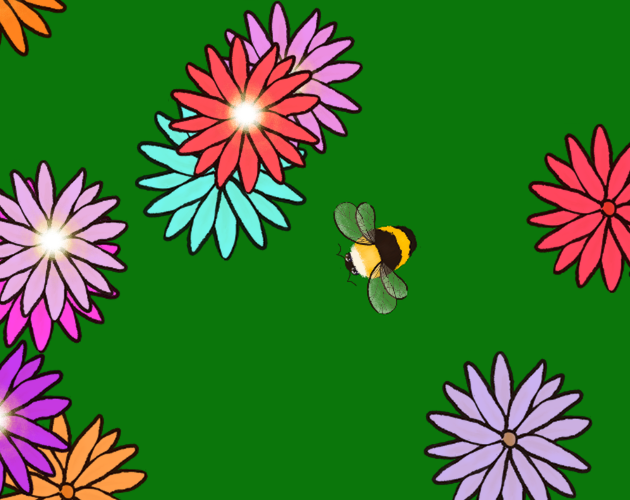

# Bumble Umble Gee

Play [Bumble Umble Gee on Itch.io](https://alanfalloon.itch.io/bumbleumblegee)!



Our small family team made a game to compete in the [Game Off
2021](https://itch.io/jam/game-off-2021/rate/1295409). In this game you play a
bumble-bee visiting flowers in a meadow.

## Building from Source

Install the [rust tools](https://rustup.rs) then you can run the code with:

```sh
cargo run
```

To play the HTML version, build the WASM version of the game

```sh
cargo build --target wasm32-unknown-unknown --release
```

Install a simple web server

```sh
cargo install basic-http-server
```

Then you can host the game like this

```sh
basic-http-server html
```

The game should be available at [http://127.0.0.1:4000](http://127.0.0.1:4000)
